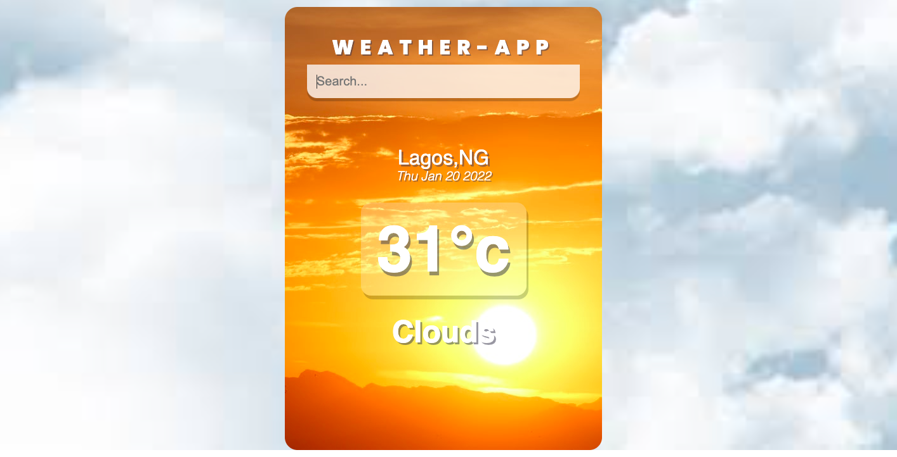

## React Real-Time Weather App

### Description: A local real-time weather App built with React, that fetches weather information and forecasts from Openweathermap.org API. It allows users to know the current weather conditions (rainy, sunny or cloudy) and accurate temperature of any location, wheresoever, in the world.

### Technologies used: React, Nodejs, express

